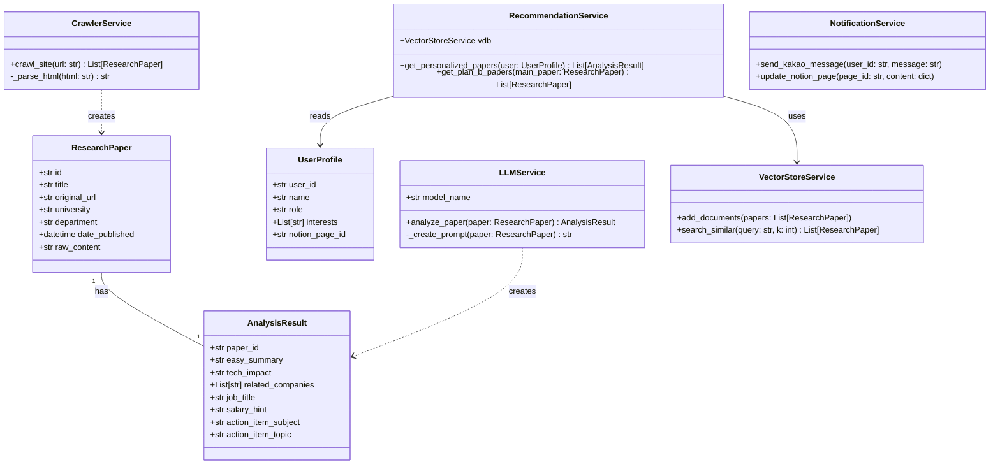

# Class Diagram

This diagram represents the core Python classes for the Univ-Insight backend.

```mermaid
classDiagram
    %% Core Domain Models
    class ResearchPaper {
        +str id
        +str title
        +str original_url
        +str university
        +str department
        +datetime date_published
        +str raw_content
    }

    class AnalysisResult {
        +str paper_id
        +str easy_summary
        +str tech_impact
        +List[str] related_companies
        +str job_title
        +str salary_hint
        +str action_item_subject
        +str action_item_topic
    }

    class UserProfile {
        +str user_id
        +str name
        +str role
        +List[str] interests
        +str notion_page_id
    }

    %% Services
    class CrawlerService {
        +crawl_site(url: str) List[ResearchPaper]
        -_parse_html(html: str) str
    }

    class LLMService {
        +str model_name
        +analyze_paper(paper: ResearchPaper) AnalysisResult
        -_create_prompt(paper: ResearchPaper) str
    }

    class VectorStoreService {
        +add_documents(papers: List[ResearchPaper])
        +search_similar(query: str, k: int) List[ResearchPaper]
    }

    class RecommendationService {
        +VectorStoreService vdb
        +get_personalized_papers(user: UserProfile) List[AnalysisResult]
        +get_plan_b_papers(main_paper: ResearchPaper) List[ResearchPaper]
    }

    class NotificationService {
        +send_kakao_message(user_id: str, message: str)
        +update_notion_page(page_id: str, content: dict)
    }

    %% Relationships
    ResearchPaper "1" -- "1" AnalysisResult : has
    RecommendationService --> VectorStoreService : uses
    RecommendationService --> UserProfile : reads
    CrawlerService ..> ResearchPaper : creates
    LLMService ..> AnalysisResult : creates
```
