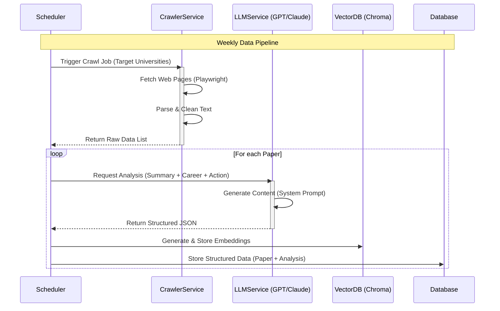
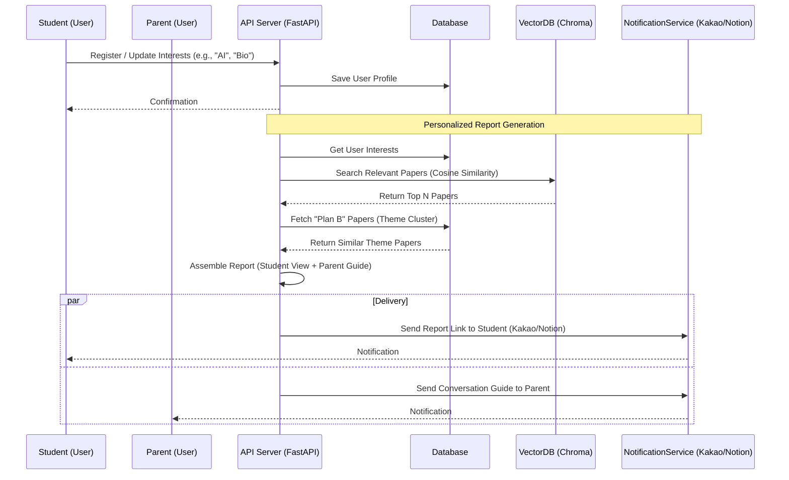

# Sequence Diagrams

## 1. Data Pipeline & Analysis (Background Process)
This process runs periodically (e.g., weekly) to fetch new research papers, analyze them with LLM, and store them.

## 2. User Service & Report Delivery
This process handles user registration and the delivery of personalized reports.

