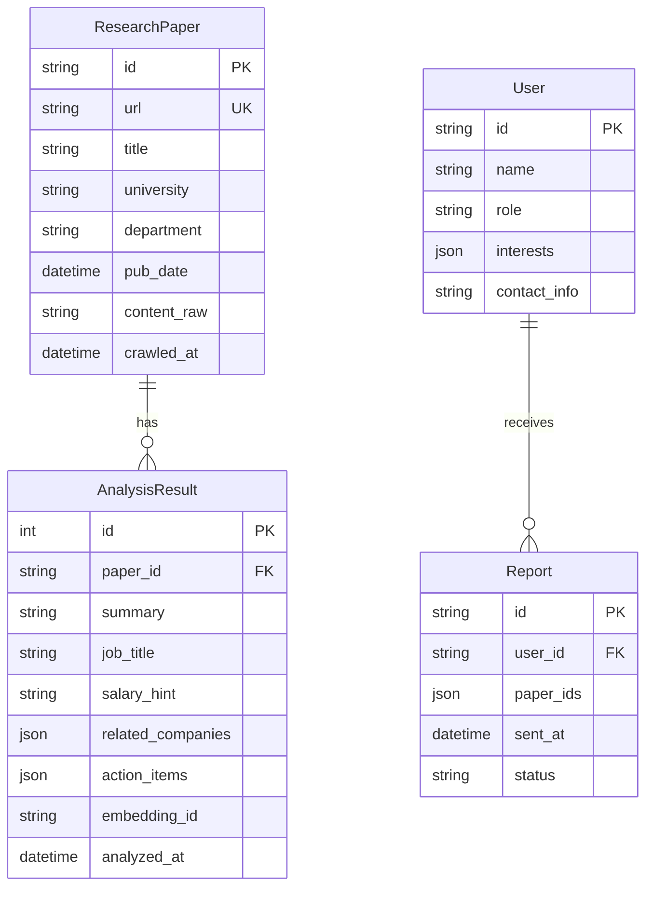

# Database Schema Specification

This document defines the physical data model for the Univ-Insight application using SQLAlchemy (ORM).

## 1. ER Diagram (Conceptual)

## 2. Table Definitions (SQLAlchemy Models)

### Table: `research_papers`
Stores the raw data crawled from university websites.

| Column Name | Type | Constraints | Description |
| :--- | :--- | :--- | :--- |
| `id` | `String(36)` | PK, UUID | Unique Identifier |
| `url` | `String(512)` | Unique, Not Null | Original URL (prevents duplicates) |
| `title` | `String(255)` | Not Null | Paper/Article Title |
| `university` | `String(50)` | Not Null | e.g., "KAIST", "SNU" |
| `university_tier` | `Integer` | Default=1 | Tier for Plan B logic (1=Top, 5=Low) |
| `department` | `String(50)` | Nullable | e.g., "CS", "Bio" |
| `pub_date` | `Date` | Nullable | Date published on the website |
| `content_raw` | `Text` | Not Null | Full text content (cleaned HTML) |
| `crawled_at` | `DateTime` | Default=Now | Timestamp of collection |

### Table: `analysis_results`
Stores the LLM-processed insights for each paper.

| Column Name | Type | Constraints | Description |
| :--- | :--- | :--- | :--- |
| `id` | `Integer` | PK, AutoInc | Internal ID |
| `paper_id` | `String(36)` | FK(`research_papers.id`) | Reference to raw paper |
| `summary` | `Text` | Not Null | "Easy Explanation" from LLM |
| `job_title` | `String(100)` | Nullable | Predicted Job Title |
| `salary_hint` | `String(100)` | Nullable | Estimated Salary Range |
| `related_companies`| `JSON` | Nullable | List of company names `["Samsung", "Naver"]` |
| `action_items` | `JSON` | Nullable | `{"subject": "Math", "topic": "..."}` |
| `embedding_id` | `String(100)` | Nullable | ID in ChromaDB (Vector Store) |
| `analyzed_at` | `DateTime` | Default=Now | Analysis Timestamp |

### Table: `users`
Stores user profiles and preferences.

| Column Name | Type | Constraints | Description |
| :--- | :--- | :--- | :--- |
| `id` | `String(50)` | PK | Kakao ID or UUID |
| `name` | `String(50)` | Not Null | User Name |
| `role` | `Enum` | 'student', 'parent' | User Type |
| `parent_id` | `String(50)` | FK(`users.id`), Nullable | Link to Parent User (if student) |
| `child_id` | `String(50)` | FK(`users.id`), Nullable | Link to Student User (if parent) |
| `interests` | `JSON` | Default=`[]` | List of keywords e.g., `["AI", "Bio"]` |
| `notion_page_id` | `String(100)` | Nullable | ID of their Notion Dashboard |

### Table: `reports`
Log of reports sent to users.

| Column Name | Type | Constraints | Description |
| :--- | :--- | :--- | :--- |
| `id` | `String(36)` | PK, UUID | Report ID |
| `user_id` | `String(50)` | FK(`users.id`) | Recipient |
| `paper_ids` | `JSON` | Not Null | List of paper IDs included |
| `sent_at` | `DateTime` | Default=Now | Time sent |
